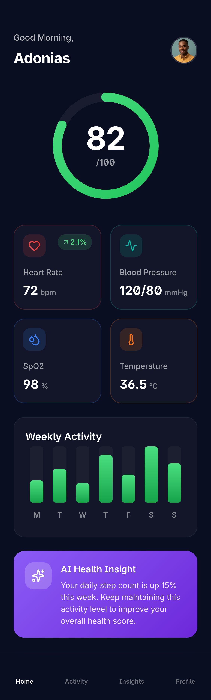

# 🏥 MediTrack Pro — AI Healthcare Companion

> An intelligent health monitoring application built with **Flutter** — featuring AI-powered symptom analysis, HealthKit/Google Fit integration, and real-time vital tracking.


<p align="center">
  
  
  
</p>

---

## ✨ Features

- 🤖 **AI Symptom Checker** — Natural language symptom analysis with medical recommendations
- ❤️ **Vital Monitoring** — Heart rate, blood pressure, SpO2, and temperature tracking
- 📊 **Health Dashboard** — Interactive charts showing health trends over time
- 🏃 **Fitness Integration** — Apple HealthKit & Google Fit sync
- 💊 **Medication Tracker** — Reminders and adherence monitoring
- 📅 **Appointment Manager** — Doctor visit scheduling and history
- 🔔 **Smart Alerts** — Health anomaly detection and emergency notifications
- 📄 **Medical Records** — Secure document storage and sharing
- 👨‍👩‍👧 **Family Profiles** — Track health for multiple family members
- 🌙 **Dark Mode** — OLED-optimized dark theme
- 🔐 **HIPAA Compliant** — End-to-end encrypted health data

---

## 🏗️ Architecture

Built with **Clean Architecture + BLoC pattern** for robust state management:

```
lib/
├── main.dart
├── app/
│   ├── app.dart                    # MaterialApp configuration
│   ├── routes.dart                 # GoRouter navigation
│   └── theme.dart                  # App theming
├── features/
│   ├── dashboard/
│   │   ├── presentation/
│   │   │   ├── pages/
│   │   │   │   └── dashboard_page.dart
│   │   │   ├── widgets/
│   │   │   │   ├── health_score_card.dart
│   │   │   │   ├── vital_summary.dart
│   │   │   │   └── daily_insights.dart
│   │   │   └── bloc/
│   │   │       ├── dashboard_bloc.dart
│   │   │       ├── dashboard_event.dart
│   │   │       └── dashboard_state.dart
│   │   ├── domain/
│   │   │   ├── entities/health_summary.dart
│   │   │   ├── repositories/dashboard_repository.dart
│   │   │   └── usecases/get_health_summary.dart
│   │   └── data/
│   │       ├── models/health_summary_model.dart
│   │       ├── datasources/health_remote_source.dart
│   │       └── repositories/dashboard_repository_impl.dart
│   ├── vitals/
│   │   ├── presentation/
│   │   ├── domain/
│   │   └── data/
│   ├── ai_assistant/
│   │   ├── presentation/
│   │   ├── domain/
│   │   └── data/
│   ├── medications/
│   │   ├── presentation/
│   │   ├── domain/
│   │   └── data/
│   └── profile/
│       ├── presentation/
│       ├── domain/
│       └── data/
├── core/
│   ├── network/
│   │   ├── api_client.dart         # Dio HTTP client
│   │   └── network_info.dart       # Connectivity
│   ├── storage/
│   │   ├── hive_storage.dart       # Local persistence
│   │   └── secure_storage.dart     # Encrypted storage
│   ├── health/
│   │   ├── healthkit_service.dart   # Apple HealthKit
│   │   └── google_fit_service.dart  # Google Fit
│   ├── ai/
│   │   └── ai_service.dart         # AI symptom analysis
│   ├── theme/
│   │   ├── app_colors.dart
│   │   ├── app_typography.dart
│   │   └── app_spacing.dart
│   └── utils/
│       ├── date_utils.dart
│       ├── validators.dart
│       └── extensions.dart
└── injection_container.dart         # GetIt dependency injection
```

---

## 🛠️ Tech Stack

| Technology | Purpose |
|-----------|---------|
| **Flutter 3.22** | Cross-platform framework |
| **Dart 3.4** | Primary language |
| **BLoC / Cubit** | State management |
| **GetIt + Injectable** | Dependency injection |
| **Dio** | HTTP networking |
| **Hive** | Local NoSQL storage |
| **Firebase** | Auth, Firestore, Cloud Functions |
| **fl_chart** | Health data visualization |
| **health** | HealthKit / Google Fit integration |
| **flutter_local_notifications** | Medication reminders |
| **GoRouter** | Declarative navigation |
| **Freezed** | Immutable data classes |

---

## 🤖 AI Integration

The AI symptom checker uses a fine-tuned medical language model:

```dart
// Example: Symptom analysis
final analysis = await aiService.analyzeSymptoms(
  symptoms: ['headache', 'fever', 'fatigue'],
  duration: Duration(days: 3),
  severity: Severity.moderate,
);

// Returns: SymptomAnalysis with possible conditions,
// urgency level, and recommended actions
```

---

## 🚀 Getting Started

```bash
git clone https://github.com/Adonias-hibeste/flutter-meditrack-pro.git
cd flutter-meditrack-pro
flutter pub get
flutter run
```

---

## 📄 License

MIT License — [LICENSE](LICENSE)

## 👨‍💻 Author

**Adonias Hibeste** — Senior Mobile Architect  
[Portfolio](https://adonias-portfolio.vercel.app) · [LinkedIn](https://linkedin.com/in/adonias-hibeste) · [GitHub](https://github.com/Adonias-hibeste)
