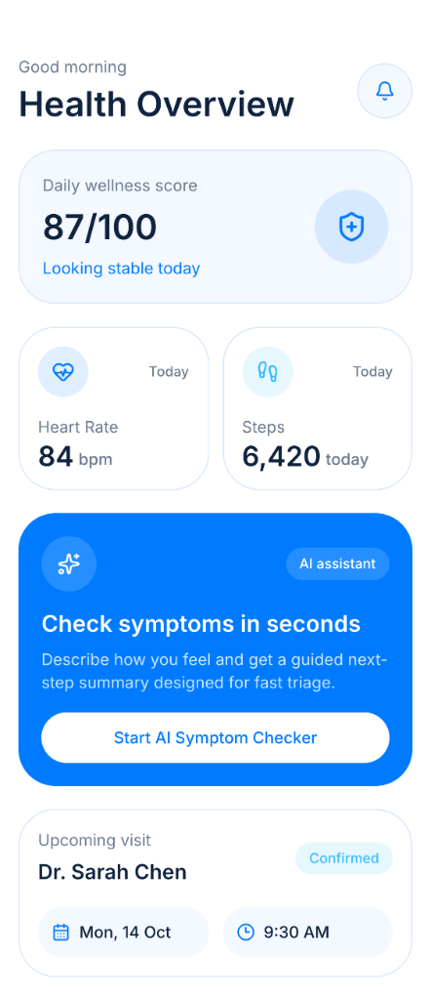
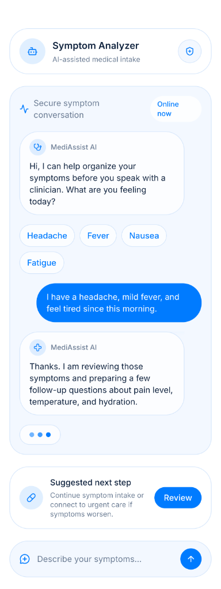

# 🏥 Meditrack Pro

**AI-Powered Health Companion.**

Meditrack Pro is a high-fidelity healthcare application built with Flutter. It features a sophisticated health monitoring dashboard, AI-assisted symptom analysis, and a professional, clinical-grade user interface designed for personal wellness management.

## 📸 Screenshots

  
  

## ✨ Features

- 📊 **Health Overview** — Real-time tracking of wellness scores, heart rate, and daily activity.
- 🤖 **AI Symptom Analyzer** — Smart medical intake chat that helps users describe and triage symptoms.
- 📅 **Appointment Management** — Clean tracking of upcoming visits and medical consultations.
- 🩺 **Triage Engine** — Suggested next steps and guided intake processes for better doctor-patient communication.
- 🛡️ **Secure Data** — Built with clinical-grade UI tokens and privacy-focused design.

## 🛠️ Tech Stack

- **Framework**: Flutter
- **State Management**: Provider / BLoC
- **Icons**: Lucide Icons
- **Design**: Clinical-Grade Healthcare UI
